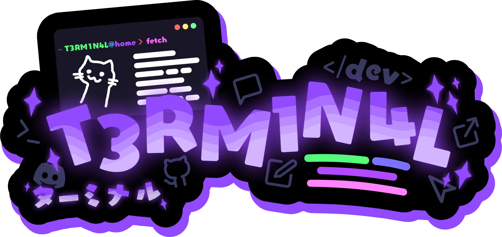

# 
&nbsp;&nbsp;&nbsp;

### <samp> 🫤 More stuff about me...</samp>
I like the color black.

<h2><samp> 💀 What I know / What I'm learning</samp></h2>

<h2><samp> 😭 Stuff</samp></h2>

 
  
   
    
   
 

