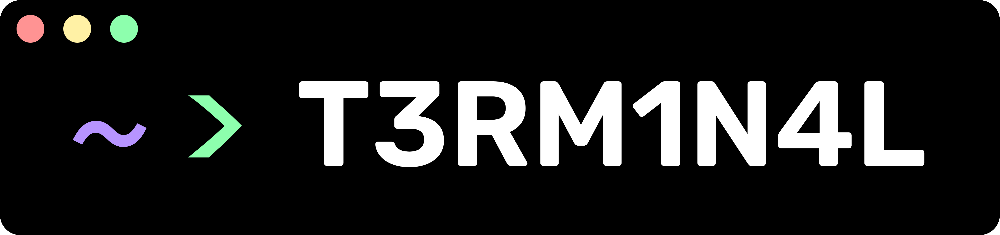
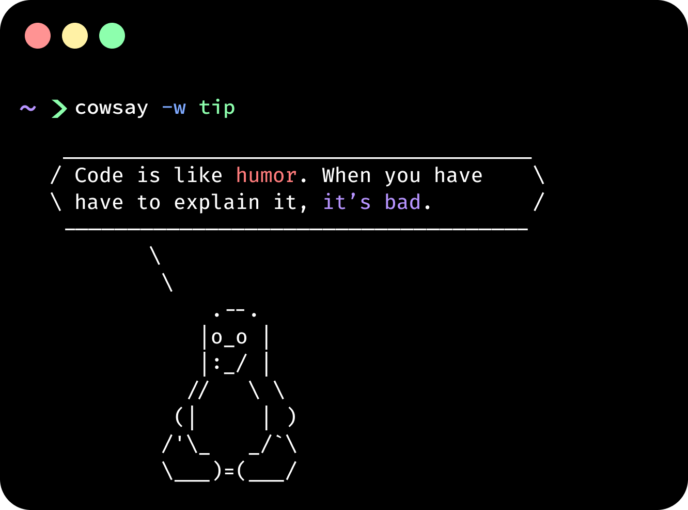

# <p align="center">&nbsp;&nbsp;&nbsp;</p>

# <samp> Whats up, `</developers>`</samp> 


### <samp>More stuff about me...</samp>
```JSON
{
  "name": "T3RM1N4L",
  "age": "13",
  "whatIDoEveryNight" : "sleep" ,
  "intrests": ["programming", "evading censorship", "sleep", "drawing", "anime", "music", "amoled theme"],
  "operatingSystem": "Mac / Arch / Win11",
  "browser": "Firefox/Chrome/Arc/Zen",
  "browserExtensions": ["Ublock Origin", "Tampermonkey", "Dark Mode", "ResourcesSaver", "Vencord"],
  "programmingLanguages": ["JS", "HTML", "C", "Python", "CSS", "Typescript", "C++"],
  "hackingTools": ["nmap", "wireshark", "hydra", "metasploit-framework", "aircrack-ng", "john",
 "burpsuite", "wpscan", "traceroute", "hashcat", "sherlock"],
    "editor": "VSCode",
    "socials": {
    "email": "t3rm1n4l9727@proton.me",
    "github": "T3M1N4L",
    "discord": "t3rm1n4l_"
  },
  "certifications": ["none lmfao i'm stupid"],
  "hasBrainDamage": true
}
```

<h2><samp>What I know / What I'm learning</samp></h2>
<p  align="center">
<a  href="">

</a>
</p>


<h2><samp>Stuff</samp></h2>
<p align="center">
  
 <a href="https://discord.com/users/861917446750863402">
  
</a>  
  <br>
  
  
</p>

